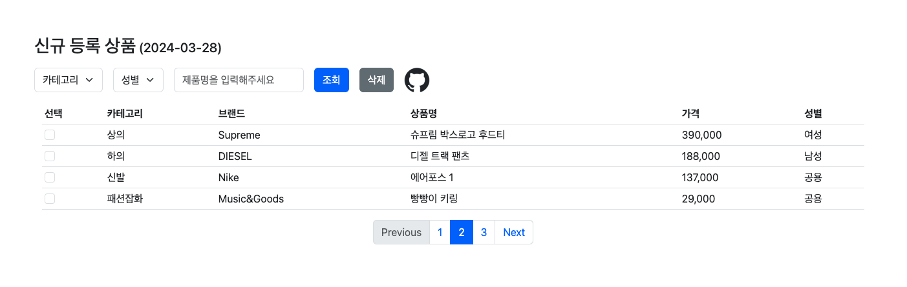

# Adminpage 제작 프로젝트

## 사용기술


## IDEs/Editors


## 팀원

YoonjuSong

## 실행방법

1. Git Repo Clone

```bash
    git clone https://github.com/yoonju977/challenge.git
```

2. Move to challenge folder

3. Run project HTML File

```bash
    cd Adminpage_project1/Admin_page.html
```

## 실행예시



## 프로젝트 목표

- KREAM을 크롤링한 데이터를 데이터베이스에 저장되었다고 가정
- 데이터베이스에 저장된 데이터를 **Admin page 방식**으로 구현하는게 목표
- **Admin page 방식은 [Bootstrap](https://getbootstrap.kr/docs/5.3/getting-started/introduction/)(v5.3) 활용**

## 프로젝트 내용

### 기본 요구 사항

- 카테고리(셀렉트)를 클릭하면 상의, 하의, 신발, 패션잡화 메뉴가 나오게 코드 작성
- 입력 버튼 안에 “제품명을 입력해주세요
- 조회 버튼이 입력창 옆에 붙어 있도록 코드 작성
- 테이블을 이용해 최 상단에는 속성 값을 넣고 하단에는 데이터가 입력되도록 코드 작성
- 최하단에는 페이지 네이션 기능이 나타나도록 코드 작성

### 더 만들어볼 기능

- 성별로 구별할 수 있는 버튼 또는 테이블 속성값에 성별을 구분할 수 있는 속성을 넣어주세요
- 카테고리 앞에 체크 박스를 하나씩 넣어주고, 선택된 체크 박스를 삭제하는 버튼을 만들어주세요 그 위치는 조회 버튼이 있는 라인의 가장 끝에 위치했으면 좋겠습니다.
- 신규 등록 상품 옆에  신규 등록 상품 (2024-01-22) 형태로 변경해주시고요 날짜는 업데이트된 일자가 반영된 도록 만들어주세요
- 테이블 하단 또는 상단에 github 아이콘을 넣어주세요 그리고 이미지 클릭하면 여러분의 깃허브 주소로 이동하도록 만들주세요

### 더 해보고싶은 기능 구현

- 카테고리, 성별 필터 추가
- 검색기능 추가
- 전체선택 및 삭제 기능


